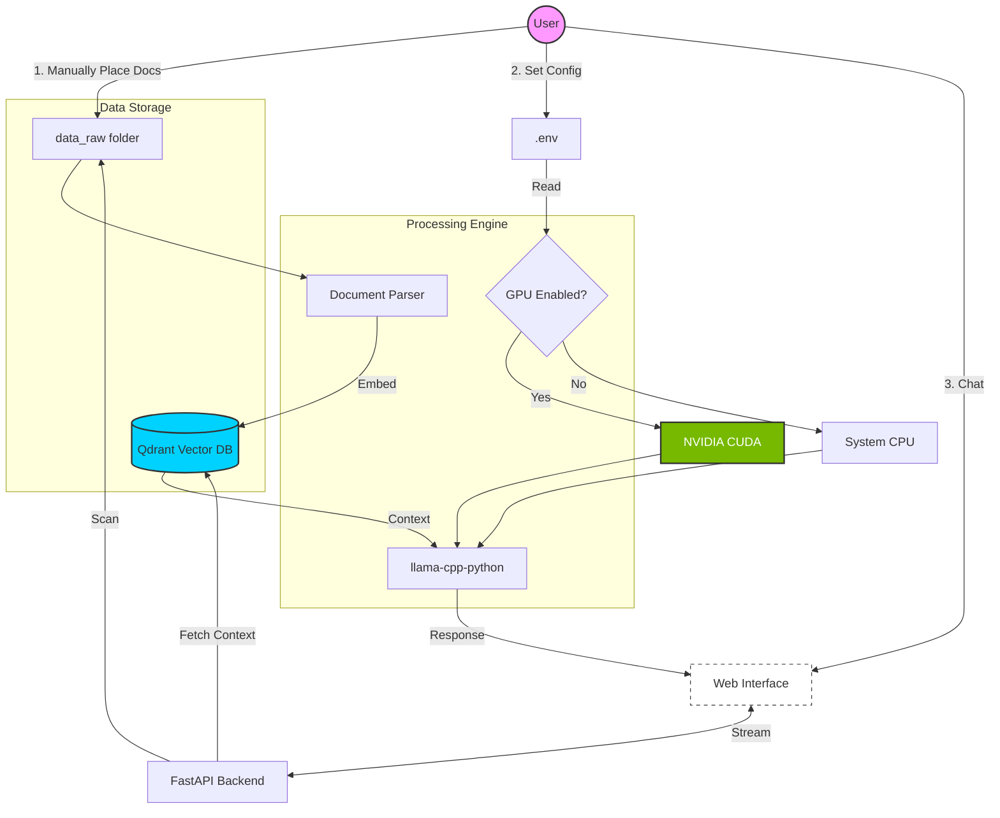

# Local RAG

A fully local retrieval-augmented generation (RAG) system for querying PDF and DOCX documents using a local LLM. No cloud, no API keys — just drop in your documents and ask questions.

> **v2.1.0** — Analytics sidebar, live tok/s tracking, max response tokens slider, GPU/CPU status badge

```
PDF / DOCX files
      |
      v
 Text extraction & cleaning
      |
      v
 Chunking (overlapping, paragraph-aware)
      |
      v
 all-MiniLM-L6-v2 embeddings (384-dim, CPU friendly)
      |
      v
 Qdrant (local vector store)
      |
      v
 FastAPI + llama.cpp  →  Browser UI
```

---



## Web UI

Once running, the web UI is accessible at `http://localhost:8000` from the machine running the stack.

**Accessing from other devices on your network:**
If you're running Local RAG on a server or another machine, access it via the host's IP address:
```
http://192.168.x.x:8000
```

**Exposing to the internet:**
Use a reverse proxy like [Caddy](https://caddyserver.com/) or [nginx](https://nginx.org/) in front of port 8000, or use a tunnel like [Cloudflare Tunnel](https://developers.cloudflare.com/cloudflare-one/connections/connect-networks/) for zero-config public access.

> ⚠️ There is no authentication built in — if exposing publicly, put it behind a password-protected reverse proxy.

### Screenshot


---

## Platform Support

| Platform | Docker | Native |
|---|---|---|
| Linux | ✅ `./run.sh --docker` | ✅ `./run.sh` |
| macOS | ✅ `./run.sh --docker` | ✅ `./run.sh` |
| Windows | ✅ `start.bat` | ⚠️ WSL2 only |

**Windows users:** Just install [Docker Desktop](https://www.docker.com/products/docker-desktop/) and double-click `start.bat` — no WSL2, Python, or manual setup needed.

**Linux/macOS native:** Requires Docker only for Qdrant. Everything else runs directly on your machine via `./run.sh`.

---

## GPU Acceleration

| Hardware | Expected Speed |
|---|---|
| CPU only (4-8B model) | 3–15 tok/s |
| NVIDIA GPU (4070 Ti) | 100–150 tok/s |
| NVIDIA GPU (3090/4090) | 150–200 tok/s |

GPU setup instructions are in the [Enabling GPU](#enabling-gpu) section below.

---

## Requirements

- Python 3.10+
- Docker
- Git, CMake, and a C++ compiler (native workflow only)

On Ubuntu:
```bash
sudo apt install build-essential cmake git docker.io python3-venv python3-full
sudo usermod -aG docker $USER && newgrp docker
```

---

## Quick Start

### 1. Clone the repo

```bash
git clone https://github.com/burnoutmonk/local_rag.git
cd local_rag
```

### 2. Add your documents

Place PDF and DOCX files in the `data_raw/` folder.

### 3. Configure

```bash
cp .env.example .env
```

Open `.env` and set at minimum:
- `LLM_MODEL_FILE` — filename of your GGUF model (downloaded automatically)
- `LLM_MODEL_REPO` — HuggingFace repo to download from
- `LLM_THREADS` — number of CPU cores to use
- `LLM_GPU_LAYERS` — set to `-1` to use GPU, `0` for CPU only

### 4. Start everything

---

#### Option A — Windows (Docker Desktop)

Install [Docker Desktop](https://www.docker.com/products/docker-desktop/) then double-click `start.bat` or run:

```cmd
start.bat
```

This starts all services in the background, waits until everything is ready, and opens your browser automatically at `http://localhost:8000`.

To stop:
```cmd
docker compose down
```

To enable GPU:
```env
# in .env
CUDA_AVAILABLE=true
LLM_GPU_LAYERS=-1
```
Then re-run `start.bat`.

---

#### Option B — Linux / macOS (Docker)

```bash
cp .env.example .env    # adjust if needed
./run.sh --docker
```

Opens your browser automatically when ready. Same GPU settings as above via `.env`.

To stop:
```bash
docker compose down
```

---

#### Option C — Linux / macOS (Native)

Runs everything directly on your machine without Docker (except Qdrant). Easier to debug and faster iteration during development.

```bash
chmod +x run.sh
./run.sh
```

This automatically:
1. Creates a Python virtual environment and installs dependencies
2. Builds llama.cpp from source (first run only — takes 10–20 minutes)
3. Downloads the model from HuggingFace
4. Starts Qdrant via Docker
5. Ingests documents from `data_raw/`
6. Measures LLM speed and updates `config.py`
7. Starts the web UI at `http://localhost:8000`

Press `Ctrl+C` to stop all services.

Useful flags:
```bash
./run.sh --skip-ingest   # skip ingestion if documents haven't changed
./run.sh --skip-llm      # skip LLM server if already running
```

---

## Configuration

All settings live in `config.py` (native) and `.env` (Docker). They share the same values — environment variables in `.env` override the defaults in `config.py`.

| Setting | Default | Description |
|---|---|---|
| `LLM_MODEL_FILE` | `qwen2.5-3b-instruct-q4_k_m.gguf` | GGUF model filename |
| `LLM_MODEL_REPO` | `Qwen/Qwen2.5-3B-Instruct-GGUF` | HuggingFace repo |
| `LLM_THREADS` | `8` | CPU threads for inference |
| `LLM_CONTEXT` | `4096` | Context window size |
| `LLM_GPU_LAYERS` | `0` | GPU layers (`-1` = all, `0` = CPU only) |
| `MAX_TOKENS` | `500` | Max output tokens |
| `TOKENS_PER_SECOND` | `10.0` | Your hardware speed (run `test_speed.py`) |
| `MAX_CHARS` | `1000` | Max chars per chunk |
| `OVERLAP_CHARS` | `100` | Chunk overlap |

---

## Enabling GPU

Using a GPU massively improves generation speed — expect 100–150 tok/s on a 4070 Ti vs 5–15 tok/s on CPU.

**Which CUDA version?** Install **CUDA 12** — it is stable, widely supported, and what llama.cpp officially targets. CUDA 13 also works but is newer and less tested.

---

### Windows (Docker — recommended)

> ✅ Tested and working with a 4070 Ti on Windows 11 + Docker Desktop.

1. Make sure you have an up to date NVIDIA driver — download from [nvidia.com/drivers](https://www.nvidia.com/Download/index.aspx)
2. Verify: open CMD and run `nvidia-smi`
3. Set in `.env`:
```env
CUDA_AVAILABLE=true
LLM_GPU_LAYERS=-1
```
4. Run `start.bat` — Docker pulls the CUDA 12 toolkit automatically inside the container, no local CUDA install needed

---

### Linux / WSL2 (Native)

1. Install CUDA 12 toolkit:
```bash
wget https://developer.download.nvidia.com/compute/cuda/repos/ubuntu2404/x86_64/cuda-keyring_1.1-1_amd64.deb
sudo dpkg -i cuda-keyring_1.1-1_amd64.deb
sudo apt update && sudo apt install cuda-toolkit-12-6
echo 'export PATH=/usr/local/cuda/bin:$PATH' >> ~/.bashrc
echo 'export LD_LIBRARY_PATH=/usr/local/cuda/lib64:$LD_LIBRARY_PATH' >> ~/.bashrc
source ~/.bashrc
```
2. Verify: `nvcc --version`
3. Delete old llama.cpp build so it rebuilds with CUDA:
```bash
rm -rf llama.cpp/build
```
4. Set in `config.py`: `LLM_GPU_LAYERS = -1`
5. Run `./run.sh`

> **WSL2 users:** First install the [NVIDIA WSL2 driver](https://developer.nvidia.com/cuda/wsl) on Windows, then follow the steps above inside WSL.

---

### Linux / WSL2 (Docker)

1. Follow the CUDA toolkit install steps above
2. Set in `.env`:
```env
CUDA_AVAILABLE=true
LLM_GPU_LAYERS=-1
```
3. Run `./run.sh --docker`

---

## Managing the Docker Stack

### Common operations

```bash
docker compose up -d        # start all services
docker compose down         # stop all services
docker compose logs -f      # follow logs from all services
docker compose logs -f api  # follow logs from a specific service
```

### When to rebuild

Most changes do NOT require a rebuild — just restart:

```bash
docker compose up -d   # picks up .env changes automatically
```

| Change | Command |
|---|---|
| `.env` parameters (tokens, threads, context) | `docker compose up -d` |
| New model | update `.env`, then `docker compose up -d` |
| Python code changes | `docker compose build api && docker compose up -d` |
| Switch GPU layers on/off | set `LLM_GPU_LAYERS=-1` or `0` in `.env`, then `start.bat` (no rebuild needed) |
| Switch CPU binary → GPU binary | set `CUDA_AVAILABLE=true` in `.env`, then `start.bat` (full rebuild) |
| Update llama.cpp | `docker compose build llm && docker compose up -d` |

### Switching models

1. Edit `.env` and set the new `LLM_MODEL_FILE` and `LLM_MODEL_REPO`
2. Run `docker compose up -d`
3. `model_downloader` will automatically fetch the new model if it isn't in `models/` already

### Re-ingesting documents

If you add or change documents in `data_raw/`:

```bash
docker compose run --rm ingest
```

This runs ingestion once and exits. Only changed or new files are re-ingested thanks to hash tracking.

---

## API Endpoints

### `POST /answer`
Retrieves relevant chunks and generates an answer with the LLM.
```bash
curl -X POST http://localhost:8000/answer \
  -H "Content-Type: application/json" \
  -d '{"query": "what is X", "top_k": 5, "mode": "answer", "timeout": 60}'
```

### `POST /answer` (search mode)
Returns raw retrieved chunks without calling the LLM. Useful for debugging retrieval.
```bash
curl -X POST http://localhost:8000/answer \
  -H "Content-Type: application/json" \
  -d '{"query": "what is X", "top_k": 5, "mode": "search"}'
```

### `GET /metrics`

Returns per-query analytics history for the current session (tok/s, prompt tokens, response tokens, response time).

### `GET /health`
Returns `{"ok": true}` if the API is running.

---

## Project Structure

```
.
├── data_raw/                  # Place your PDF and DOCX files here
├── models/                    # GGUF model downloaded here automatically
├── templates/
│   └── index.html             # Browser UI with GPU/CPU status badge
├── config.py                  # All settings (native workflow)
├── .env.example               # All settings (Docker workflow) — copy to .env
├── run.sh                     # Linux/macOS entry point (native or --docker)
├── start.bat                  # Windows entry point (Docker)
├── start.py                   # Native launcher (Qdrant + ingest + LLM + API)
├── ingest.py                  # Parse, chunk, embed, and upsert into Qdrant
├── rag_api.py                 # FastAPI retrieval + LLM answer API
├── download_model.py          # Auto model downloader (Docker)
├── benchmark.py               # LLM speed benchmark (Docker)
├── test_speed.py              # Manual LLM speed test (native)
├── Dockerfile                 # CPU image for all Python services
├── Dockerfile.cuda            # GPU image (CUDA 12, nvidia base)
├── docker-compose.yml         # Full stack orchestration
├── docker-compose.gpu.yml     # GPU overlay (merged by start.bat/run.sh)
└── requirements.txt
```

---

## Tips

- **Retrieval quality:** `top_k=5` is a good default. Increase if answers feel incomplete.
- **Chunk size:** `MAX_CHARS=1000` works well for most documents. Reduce to 600–700 for documents with many short definitions.
- **Speed:** Run `python test_speed.py` after startup to measure your actual tok/s and update `TOKENS_PER_SECOND` in your config.
- **Incremental ingestion:** Only changed or new files are re-ingested. Delete `.ingest_hashes.json` to force a full re-ingest.
- **Upgrading embeddings:** Swap MiniLM for `BAAI/bge-m3` and enable hybrid dense+sparse search for better retrieval quality (requires GPU).
- **Max response tokens:** Use the slider in the UI to control response length. 500 is a good default — increase for more detailed answers.
- **Analytics:** The sidebar tracks tok/s, prompt/response token counts, and average response time per session. Resets on container restart.
- **GPU toggle:** Set `LLM_GPU_LAYERS=-1` or `0` in `.env` and restart — no rebuild needed to switch GPU on/off.

---

## License

MIT — see [LICENSE](LICENSE)
